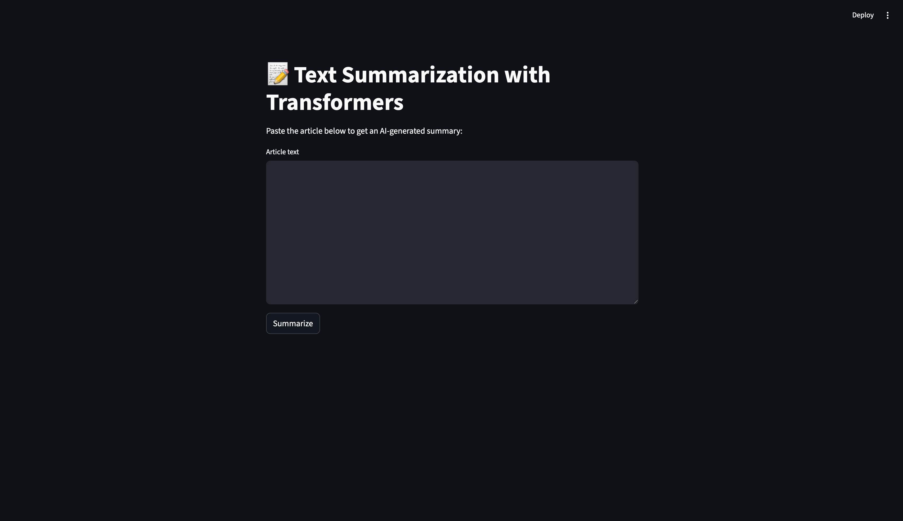

## Text Summarization with Transformers

An AI-powered abstractive text summarization system built using Hugging Face Transformers.
It fine-tunes transformer models like BART, T5, Pegasus on summarization datasets (CNN/DailyMail, XSum) and provides a Streamlit web app for easy use.

##  Project Structure

Text_Summarization_with_Transformers/                                                                                                                                        
├                                                                                                                                                                            
├── app.py              -----------------------># Streamlit web app for summarization                                                                                        
├── train.py            ---------------------># Fine-tune summarization models (BART/T5/Pegasus)                                                                           
├── utils.py            ---------------------># Helper functions (preprocessing, evaluation, etc.)(optional)                                                                 
├── config.py           ------------------># Centralized configuration (model/dataset paths, params)(optional)                                                               
├── requirements.txt    ----------># Python dependencies                                                                                                                     
└── README.md           -------------># Project documentation

## Interface 👇🏻

## Setup

## Clone repo & enter folder

git clone <repo-url>
cd Text_Summarization_with_Transformers

## Create virtual environment
python3 -m venv venv
source venv/bin/activate   # Linux/Mac
venv\Scripts\activate      # Windows

## Install dependencies
pip install -r requirements.txt

##  Training
Fine-tune a summarization model on CNN/DailyMail or XSum:
python train.py

Saves the model in ./summarizer_model/
Supports BART, T5, and Pegasus
Evaluation with ROUGE and BLEU

## Running Web App
Launch the Streamlit app:
streamlit run app.py

Paste an article into the textbox
Click Summarize
Get an AI-generated summary instantly 🎉

## Evaluation Metrics
ROUGE: Recall-Oriented Understudy for Gisting Evaluation
BLEU: Bilingual Evaluation Understudy

## Example
## Input:
The stock market experienced a sharp decline today, with major indexes falling more than 2%...
## Output:
The stock market dropped over 2% today, marking a significant downturn across major indexes.

## Tech Stack
Transformers (Hugging Face)
PyTorch
Datasets (CNN/Daily Mail, XSum)
Streamlit (for deployment)

## error handling, bus error

pip uninstall -y numpy
pip install "numpy<2"
pip install --force-reinstall --no-cache-dir scipy scikit-learn transformers

rm -rf venv
python3 -m venv --without-pip venv
source venv/bin/activate
curl https://bootstrap.pypa.io/get-pip.py | python
pip install -r requirements.txt

## 🚑 Error Handling: numpy.core.multiarray failed to import
## Steps to fix
## Check NumPy version
python -c "import numpy; print(numpy.__version__)"

## 👉 If it’s 2.x, that’s the issue.
## Downgrade NumPy
pip uninstall -y numpy
pip install "numpy<2"

## Reinstall key libs
pip install --force-reinstall --no-cache-dir torch torchvision torchaudio transformers

## Test imports
python -c "from transformers import AutoTokenizer; print('Transformers OK')"

## ⚠️ If you see (base) alongside (venv), conda is leaking into your venv.
## Fix with:
conda config --set auto_activate_base false
